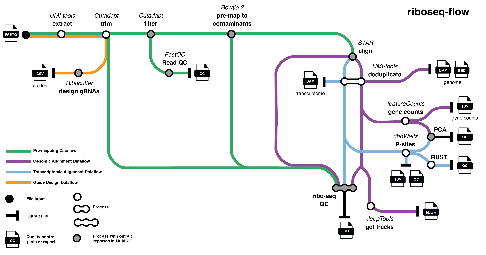

[](https://zenodo.org/doi/10.5281/zenodo.10372020)
[](https://doi.org/10.12688/wellcomeopenres.21000.1)
[](https://github.com/iraiosub/riboseq-flow/actions/workflows/riboseq-flow-ci.yml)


# riboseq-flow - A Nextflow DSL2 pipeline to perform ribo-seq data analysis and comprehensive quality control


## Citation

If you use **riboseq-flow**, please cite:

> **Iosub IA, Wilkins OG and Ule J.**
> *Riboseq-flow: A streamlined, reliable pipeline for ribosome profiling data analysis and quality control*
> **Wellcome Open Research 2024**, **9:179**
> [https://doi.org/10.12688/wellcomeopenres.21000.1](https://doi.org/10.12688/wellcomeopenres.21000.1)

## Table of contents

1. [Introduction](#introduction)
2. [Pipeline summary](#pipeline-summary)
3. [Quick start (test the pipeline)](#quick-start-test-the-pipeline-with-a-minimal-dataset)
4. [Quick start (run the pipeline on your data)](#quick-start-run-the-pipeline-on-your-data)
5. [Pipeline parameters](#pipeline-parameters)
6. [Pipeline outputs](#pipeline-outputs)
7. [Pre-download container images](#pre-download-container-images)
8. [Authors and contact](#authors-and-contact)
9. [Issues and contributions](#issues-and-contributions)
10. [Contributing guidelines](#contributing-guidelines)
11. [Why use riboseq-flow](#why-use-riboseq-flow)

## Introduction

riboseq-flow is a Nextflow DSL2 pipeline for the analysis and quality control of ribo-seq data.

## Pipeline summary

1. UMI extraction ([`UMI-tools`](https://umi-tools.readthedocs.io/en/latest/)) (Optional)
2. Adapter and quality trimming, read length filtering ([`Cutadapt`](https://cutadapt.readthedocs.io)) (Optional)
3. Read QC ([`FastQC`](https://www.bioinformatics.babraham.ac.uk/projects/fastqc/))
4. Pre-mapping to remove reads mapping to contaminants ([`Bowtie2`](https://bowtie-bio.sourceforge.net/bowtie2/index.shtml), [`SAMtools`](https://sourceforge.net/projects/samtools/files/samtools/)) (Optional)
5. Mapping to the genome and transcriptome ([`STAR`](https://github.com/alexdobin/STAR))
6. UMI-based deduplication ([`UMI-tools`](https://umi-tools.readthedocs.io/en/latest/),[`SAMtools`](https://sourceforge.net/projects/samtools/files/samtools/), [`BEDTools`](https://github.com/arq5x/bedtools2/)) (Optional)
7. Extensive QC specialised for ribo-seq ([`mapping_length_analysis`](https://pypi.org/project/mapping-length-analysis/),[`R`](https://www.r-project.org/)) (Optional)
8. Gene-level read quantification ([`FeatureCounts`](https://subread.sourceforge.net/))
9. P-site identification, CDS occupancy and P-site diagnostics ([`riboWaltz`](https://github.com/LabTranslationalArchitectomics/riboWaltz/)) (Optional)
10. Principal Component Analysis (PCA) using gene-level read counts and P-site counts over CDS regions ([`DESeq2`](https://bioconductor.org/packages/release/bioc/html/DESeq2.html))
11. Generation of coverage tracks ([`deepTools`](https://deeptools.readthedocs.io/en/develop/))
12. Design of sgRNA templates to deplete unwanted abundant contaminants ([`Ribocutter`](https://www.biorxiv.org/content/10.1101/2021.07.14.451473v1.full)) (Optional)
13. MultiQC report of reads QC, mapping statistics, PCA and summarised ribo-seq QC metrics ([`MultiQC`](https://multiqc.info/))
14. Tracking reads and visualisation of read fate through the key pipeline steps ([`networkD3`](https://www.rdocumentation.org/packages/networkD3/))




## Quick start (test the pipeline with a minimal dataset)

1. Ensure `Nextflow`(version `21.10.3` or later) and `Docker` or `Singularity` (version `3.6.4` or later) are installed on your system.
Nextflow installation instructions can be found [here](https://nf-co.re/docs/usage/installation).
We recommend using Nextflow with `Java 17.0.9` or later.

**Note:** The pipeline has been tested on with `Nextflow` versions `21.10.3`, `22.10.3`, `23.04.2`, `23.10.0`, `24.10.2` and `25.10.0`.

2. Pull the desired version of the pipeline from the GitHub repository:

```
nextflow pull iraiosub/riboseq-flow -r v1.2.0
```

3. Run the pipeline on the provided test dataset:

Using Singularity:

```
nextflow run iraiosub/riboseq-flow -r v1.2.0 -profile test,singularity
```

or using Docker:

```
nextflow run iraiosub/riboseq-flow -r v1.2.0 -profile test,docker
```

4. Check succesful execution.


## Quick start (run the pipeline on your data)

1. Ensure `Nextflow` and `Docker`/`Singularity` are installed on your system.
2. Pull the desired version of the pipeline from the GitHub repository:

```
nextflow pull iraiosub/riboseq-flow -r v1.2.0
```

3. Create a samplesheet `samplesheet.csv` with information about the samples you would like to analyse before running the pipeline. It has to be a comma-separated file with 2 columns, and a header row as shown in the example below.

**Note:** Only single-end read data can be used as input; if you used paired-end sequencing make sure the correct read is used for the analysis.

```
sample,fastq
sample1,/path/to/file1.fastq.gz
sample2,/path/to/file2.fastq.gz
sample3,/path/to/file3.fastq.gz
```

4. Run the pipeline. The typical command for running the pipeline is as follows (the minimum parameters have been specified):

```
nextflow run iraiosub/riboseq-flow -r v1.2.0 \
-profile singularity,crick \
-resume \
--input samplesheet.csv \
--fasta /path/to/fasta \
--gtf /path/to/gtf \
--contaminants_fasta /path/to/contaminants_fasta \
--strandedness forward
```

## Pipeline parameters

### Core Nextflow arguments

- `-profile`: specifies a configuration profile. Profiles can give configuration presets for different compute environments. Options are `test`, `docker`,`singularity` and `crick` depending on the system being used and resources available. Others can be found at [nf-core](https://github.com/nf-core/configs).
- `-resume`: specify this when restarting a pipeline. Nextflow will use cached results from any pipeline steps where the inputs are the same, continuing from where it got to previously. For input to be considered the same, not only the names must be identical but the files'contents as well.

### General parameters

- `--input` specifies the input sample sheet
- `--outdir` specifies the output results directory
    - default: `./results`
- `--tracedir` specifies the pipeline run trace directory
    - default: `./results/pipeline_info`

### Genome parameters

The pipeline is compatible with any well-annotated organism for which a FASTA genone file and GTF annotation (and ideally rRNA and other contaminat sequences) are available. Recommended sources for these files are [GENCODE](https://www.gencodegenes.org/) and [Ensembl](https://www.ensembl.org/index.html).
**Important:** The GTF file must include UTR annotations, and the format should follow the standards set by Ensembl or GENCODE.

_Simplified Option for Human and Mouse:_

Use the `--org` flag to automatically download and set up reference files for human or mouse genomes, eliminating the need to manually provide them.
Available options for `--org` are `GRCh38` (human) and `GRCm39` (mouse).

When `--org` is specified, all annotation files are sourced from the paths in the [genomes.config](https://github.com/iraiosub/riboseq-flow/blob/main/conf/genomes.config) file.

_Manual Annotation File Specification:_

If `--org` is not specified, the user needs to provide full paths to all required annotation files:

- `--fasta` path to the FASTA genome file
- `--gtf` path to the GTF annotation file
- `--contaminants_fasta` path to the FASTA file of abundant RNA contaminants (like rRNA). (Required if pre-mapping is enabled)
- `--star_index` path to directory of pre-built STAR index (Optional). If not provided, the pipeline will generate the STAR index.
- `--transcript_info` path to TSV file with a single representative transcript for each gene, with information on CDS start, length, end and transcript length (Optional).  If not provided, the pipeline will create it using the GTF file, selecting the longest CDS transcript per gene. The transcript IDs in this file must match those in the GTF file. An example file format can be found [here](https://github.com/iraiosub/riboseq-flow/blob/main/assets/transcript_info/gencode.v44.primary_assembly.annotation.longest_cds.transcript_info.tsv). 
- `--transcript_fasta` path to transcripts FASTA (full sequence, including CDS and UTRs) and matches the `transcript_info` file. (Required if supplying the `transcript_info` file). If not provided, the pipeline will generate this file for the selected representative transcripts. 

- `--save_index` save the Bowtie2 and STAR indexes generated by the pipeline. By default, not enabled.

### Tool specific parameters

The pipeline allows the user to set preferred parameter values, or the option to skip pipeline steps, as detailed below. 
Most parameters have default values, which will be used by the pipeline unless the user overrides them by adding the appropriate options to the run script. 
Where a default value is missing, the user must provide an appropriate value. All pre-defined parameter values are listed [here](https://github.com/iraiosub/riboseq-flow/blob/main/conf/defaults.config).

#### UMI options

The pipeline supports UMI-based deduplication. If UMIs were used, you must explicitly specify so by providing the appropriate arguments.

- `--with_umi` enables UMI-based read deduplication. Use if you used UMIs in your protocol. By default, not enabled.
- `--skip_umi_extract` skips UMI extraction from the read in case UMIs have been moved to the headers in advance or if UMIs were not used
- `--umi_extract_method` specify method to extract the UMI barcode (options: `string` (default) or `regex`)
- `--umi_pattern` specifies the UMI barcode pattern,  e.g. 'NNNNN' indicates that the first 5 nucleotides of the read are from the UMI.
- `--umi_separator` specifies the UMI barcode separator (default: `_`; use `rbc:` if Ultraplex was used for demultiplexing)

#### Read trimming and filtering options

Read trimming steps are executed in the following order: (i) adaptors and low quality bases are trimmed, (ii) bases that need to be removed from read extremities are removed (e.g. non-templated bases, if applicable) and (iii) reads shorter than a minimum length are filtered out. 

- `--skip_trimming` skip the adapter and quality trimming and length filtering step
- `--save_trimmed` save the final and intermediate FASTQ files produced during the trimming steps. By default, not enabled.
- `--adapter_threeprime` sequence of 3' adapter (equivalent to `-a` in `cutadapt`)
- `--adapter_fiveprime` sequence of 5' adapter (equivalent to `-g` in `cutadapt`)
- `--times_trimmed` number of times a read will be adaptor trimmed (default: `1`)
- `--cut_end` number of nucleotides to be trimmed from 5' or 3' end of reads (equivalent to `-u` in `cutadapt`). Supply positive values for trimming from the 5' end, and negative values for trimming from the 3'end (default `0`, no residues are trimmed). **Important:**: This step is perfomed after adapter trimming, and after UMIs have been moved to the read header. Useful for libraries where non-templated nucleotides are part of the read and need trimming (e.g. template-switching, OTTR libraries).
- `--minimum_quality` cutoff value for trimming low-quality ends from reads (default: `10`)
- `--minimum_length` minimum read length after trimming (default: `20`)

#### Ribocutter options

[`Ribocutter`](https://github.com/Delayed-Gitification/ribocutter) is a tool for designing sgRNA templates to deplete unwanted abundant contaminants.

- `--skip_ribocutter` skips Ribocutter
- `--guide_number` number of guides to design (default: `50`)
- `--max_reads` maximum number of reads analysed (default: `1000000`)
- `--min_read_length` minimum read length threshold for reads to be analysed
- `--extra_ribocutter_args` string specifying additional arguments that will be appended to the `ribocutter` command

#### Read alignment options

- `--skip_premap` skips pre-mapping to common contaminant sequences
- `--bowtie2_args` allows users to input custom arguments for Bowtie2
- `--star_args` enables the input of specific arguments for STAR

The preset alignment settings for both STAR and Bowtie2 are optimized for standard ribo-seq analysis. Altering these arguments is generally not advised unless specific data requirements or unique analytical needs arise.


#### Gene-level quantification options

- `--strandedness` specifies the library strandedness (options: `forward`, `reverse` or `unstranded`) (Required)
- `--feature` specifies the feature to be summarised at gene-level (options: `exon` or `CDS`) (default: `exon`)

#### Ribo-seq quality control options

- `--skip_qc` skips mapping length analysis and generation of ribo-seq QC plots
- `--expected_length` expected read lengths range. Used to report the proportion of reads of expected lengths in the aligned reads, for the generation of ribo-seq QC plots, and for specifying the range of read lengths used for P-site identification  (default: `26:32`). 

**Important:**  The `--expected_length` parameter does not filter reads based on this length range for any other analyses, including alignment, gene-level quantification or track data generation.

#### P-site identification and quantification options

P-sites are identified with [`riboWaltz`](https://github.com/LabTranslationalArchitectomics/riboWaltz/). It is strongly recommended to check the riboWaltz method to ensure the approach is suitable for your data. By default, the reads must be in length bins that satisfy periodicity to be used for P-site offset calculations. Additionally, the user can specify the following options:

- `--skip_psite` skips P-site identification and riboWaltz diagnotics plots
- `--expected_length` expected read lengths range. Used to report the proportion of reads of expected lengths in the aligned reads, for the generation of ribo-seq QC plots, and for specifying the range of RPF lengths used for P-site identification (default: `26:32`). 
- `--periodicity_threshold` specifies the periodicity threshold for read lengths to be considered for P-site identification (default: `50`)
- `--psite_method` specifies method used for P-site offsets identification (options: `ribowaltz` (default) or `global_max_5end`).
     - For `ribowaltz` P-site offsets are defined using [`riboWaltz`](https://github.com/LabTranslationalArchitectomics/riboWaltz/).
     - For `global_max_5end` P-site offsets are defined by the distances between the first nucleotide of the translation initiation site and the nucleotide corresponding to the global maximum of the read length-specific 5'end profiles (the first step of the riboWaltz method). Compared to riboWaltz-defined offsets, only the 5' extremities of the reads are considered for calculation and no further offset correction is performed after read-length global maximum identification.
- `exclude_start` specifies the number of nucleotides 3' from the start codon to be excluded from CDS P-site quantification (default: `42`, i.e. exclude the first 14 codons)
- `exclude_stop` specifies the number of nucleotides 5' from the stop codon to be excluded from CDS P-site quantification (default: `27`, i.e. exclude the last 9 codons)

- `genomic_codon_coverage` convert transcript positions of inferred P-sites mapping on each triplet of annotated CDS and UTR to genomic coordinates and report geomic coordinates and P-site counts in a BED file. By default, not enabled.

**Important:** P-sites and information are identified using transcriptomic coordinates. For this, a representative transcript is selected for each gene. The selection is based on the following hierarchy: CDS length > total length > number of exons > 5'UTR length > 3'UTR length. The selection is performed automatically by the pipeline using the information in the provided GTF file, and stored in `*.longest_cds.transcript_info.tsv`. The default representative transcript table can be overriden by the user by providing their own table with `--transcript_info` (see instructions above).


#### Coverage tracks options

- `--bin_size` spcifies bin size for calculating coverage (i.e. the number of nt per bin). Bins are short consecutive counting windows of a defined size. (default: `1`)
- `--track_format` specifies output file type (options: `bigwig`(default) or `bedgraph`)

## Pipeline outputs

The pipeline outputs results in a number of folders:

```
.
├── annotation
├── preprocessed
├── fastqc
├── premapped
├── mapped
├── deduplicated
├── riboseq_qc
├── featurecounts
├── psites
├── coverage_tracks
├── ribocutter
├── multiqc
└── pipeline_info
```

### Files

- `annotation` contains information on the representative transcript per gene used for ribo-eq QC and P-site analyses, as well as bowtie2, STAR indexes and annotation files used by the pipeline
    - `*.longest_cds.transcript_info.tsv` TSV file with a single representative transcript for each gene, with information on CDS start, length and end
    - `bowtie2` and `star` folders with indexes used for aligning reads (if `--save_index` enabled)
- `preprocessed` contains reads pre-processed according to user settings for UMI extraction and trimming and filtering (if `--save_trimmed` enabled) and the corresponding logs. The `*.filtered.fastq.gz` files are used for downstream alignment steps.
- `fastqc` contains FastQC reports of pre-processed reads (`*.filtered.fastq.gz`)
- `premapped` contains  files from aligning reads to contaminants:
    - `*.bam` BAM format alignments to contaminants
    - `*.bam.seqs.gz` mapping locations and sequences of contaminant-mapped reads
    - `*.unmapped.fastq.gz` sequencing reads that did not map to the contaminants in FASTQ format
    - `*.premap.log` is the bowtie2 log file
- `mapped` contains files resulting from alignment to the genome and transcriptome:
    - `*.Aligned.sortedByCoord.out.bam` read alignments to the genome in BAM format
    - `*.Aligned.toTranscriptome.out.bam` read alignments to the transcriptome in BAM format
    - `*.Log.final.out` is the STAR log output file
- `deduplicated` contains files resulting after deduplication based on genomic or transcriptomic location and UMIs:
    - `*.genome.dedup.sorted.bam` UMI deduplicated alignments to the genome, in BAM format
    - `*.transcriptome.dedup.sorted.bam` UMI deduplicated alignments to the transcriptome in BAM format
- `riboseq_qc` contains QC plots informing on read and mapping lengths, frame, periodicity, signal around start and stop codons, contaminants content, duplication, fraction of useful (mapped to protein-coding transcripts) reads, proprtion of reads remaining after alignment steps etc and folders containing other QC results.
    - `*.qc_results.pdf` per-sample QC reports with specialised ribo-seq quality metrics stratified by read length
    - `mapping_length_analysis` contains CSV files with number of raw and mapped reads by length:
        - `*.after_premap.csv` 
        - `*.before_dedup.csv` 
        - `*.after_dedup.csv`
    - `multiqc_tables` contains TSV files with sample summary metrics for multiQC
    - `read_fate` contains sample-specific html files tracking read fate through the pipeline steps, a visualisation that helps understanding the yield of useful reads and troubleshooting. 
    - `pca` contains PCA plots and rlog-normalised count tables. Only produced if 3 samples or more are analysed.
    - `rust_analysis` contains [`RUST`](https://www.nature.com/articles/ncomms12915) metafootprint analysis, with plots showing the Kullback–Leibler divergence (K–L) profiles stratified by read length, using the inferred P-sites.
- `featurecounts` contains gene-level quantification of the UMI deduplicated alignments to the genome
- `psites` contains P-sites information, codon coverage and CDS coverage tables, and riboWaltz diagnostic plots:
    - `psite_offset.tsv.gz` P-site offsets for each read-length for all samples
    - `*psite.tsv.gz` ample-specific P-site information for each read
    - `ribowaltz_qc` folder containing P-site diagnostic plots generated by riboWaltz
    - `*.coverage_psite.tsv.gz` P-site counts over the CDS of representative transcripts, or over a CDS window excluding a spcified region downstream start codons and upstream stop codons
    - `codon_coverage_psite.tsv.gz` P-sites counts on each triplet of annotated CDS and UTR for each transcript
    - `codon_coverage_rpf.tsv.gz` RPF counts on each triplet of annotated CDS and UTR for each transcript
    - `offset_plot` contains plots that detail P-site assignment using the  method
- `coverage_tracks` contains track files in BED and bigWig or bedGraph format
    - `*.bigwig` UMI deduplicated genome coverage tracks in bigWig format
    - `*.bedgraph` UMI deduplicated genome coverage tracks in bedGraph format
    - `*.genome.dedup.bed.gz` UMI deduplicated alignments to the genome in BED format
    - `*.transcriptome.dedup.bed.gz` UMI deduplicated alignments to the transcriptomie in BED format
    - `psite/*.codon_coverage_psite.bed.gz` folder containing BED files with the genomic coordinates and counts of inferred P-sites mapping on each triplet of annotated CDS and UTR for each transcript. Obtained by converting transcriptomic positions from `codon_coverage_psite.tsv.gz` to genomic coordinates.
- `ribocutter` contains results of Ribocutter run on the pre-processed reads of minimum length defined by user, and minimum length of 23 nt, respectively
    - `*.csv` CSV files with the designed oligo sequences, their target sequence, the fraction of the library that each oligo targets and the total fraction of the library targeted by all oligos
    - `ribocutter.pdf` plot showing the estimated fraction of the library that is estimated to be targeted by the guides designed using Ribocutter
- `multiqc` contains a MultiQC report summarising the FastQC reports, pre-mapping and mapping logs, and summarised ribo-seq QC metrics
- `pipeline_info` contains the execution reports, traces and timelines generated by Nextflow:
    - `execution_report.html`
    - `execution_timeline.html`
    - `execution_trace.txt`

## Pre-download container images

When a Nextflow pipeline requires multiple Docker images, it can sometimes fail to pull them, leading to pipeline execution failures. In such scenarios, pre-downloading the container images to a designated location on your system can prevent this. 

Follow these steps to pre-download and cache the necessary images:
1. Identify the desired location on your system where you want to store the container images.
2. Set the `NXF_SINGULARITY_CACHEDIR` environment variable to point to this chosen location.
For example, you can add the following line to your shell profile or run script:

```
export NXF_SINGULARITY_CACHEDIR=/path/to/image/cache
```
3. Make sure you have `Singularity` installed. Please use the same version you intend to use for running the pipeline. 
4. Run the code below to pre-download and cache the required Docker images:

```
#!/bin/sh

# A script to pre-download Singularity images required by iraiosub/riboseq-flow pipeline

# change dir to your NXF_SINGULARITY_CACHEDIR path
cd /path/to/image/cache

singularity pull iraiosub-nf-riboseq-latest.img docker://iraiosub/nf-riboseq
singularity pull iraiosub-mapping-length-latest.img docker://iraiosub/nf-riboseq-qc
singularity pull iraiosub-nf-riboseq-dedup-latest.img docker://iraiosub/nf-riboseq-dedup
```

### Authors and contact

riboseq-flow is written and maintained by Ira Iosub in Prof. Jernej Ule's lab at The Francis Crick Institute. It is based on a Snakemake pipeline in collaboration with its original author, Oscar Wilkins. 
Contact email: `ira.iosub@crick.ac.uk`

### Citation policy
Please ensure the paper and Zenodo DOIs above are cited in any reuse, fork, or hosted implementation of this workflow.

### Issues and contributions

riboseq-flow is under active development by Ira Iosub. For queries related to the pipeline, raise an issue on GitHub.
If you are interested in building more functionality or want to get involved please reach out.

---

### Contributing guidelines

We welcome contributions to riboseq-flow.

If you wish to make an addition or change to the pipeline, please follow these steps:

1. Open an issue to detail the proposed fix or feature and select the appropriate label.
2. Fork this repo.
3. Create a new branch based on the `dev` branch, with a short, descriptive name e.g. `feat-colours` for making changes to a color palette.
4. Modify the code exclusively on this new branch and mention the relavant issue in the commit messages.
5. When your modifications are complete, submit a pull request to the `dev` branch describing the changes. 
6. Request a review from iraiosub on your pull request.
7. The pull request will trigger a workflow execution on GitHub Actions for continuous integration (CI) of the pipeline.
This is designed to automatically test riboseq-flow whenever a pull request is made to the main or dev branches of the repository.
It ensures that the pipeline runs correctly in an Ubuntu environment, helping to catch any issues or errors early in the development process. 

## Why use riboseq-flow

- **User-friendly:** requires only minimal command-line experience.  
- **Portable and reproducible:** runs identically across systems using Docker or Singularity.  
- **Self-contained:** no manual dependency installation—each process runs in a container with the exact software it needs.  
- **Reproducible results:** produces the same outputs regardless of platform, a cornerstone of computational reproducibility.  
- **Scalable:** efficiently processes many samples in parallel for comparative studies.  
- **Integrated QC:** combines data processing with extensive ribo-seq–specific QC.  
- **Transparent:** tracks read counts at every step and provides custom QC reports for each sample.  
- **Insightful:** visualises read fate and key metrics, helping users make informed downstream decisions.  
- **Open and FAIR:** fully version-controlled, openly available, and compliant with FAIR principles.


